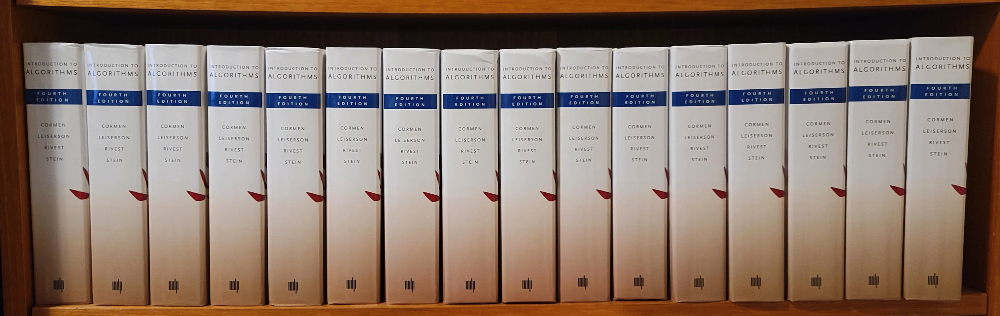

# Introduction to Algorithms

Oficial book resources: https://mitpress.mit.edu/9780262046305/introduction-to-algorithms/

This repository houses my solutions to the exercises found in the 'Introduction to Algorithms' book. Explore this collection to access my comprehensive answers, which serve as a valuable resource for those studying this fundamental subject.



---

## 🛠️ Setup Locally

1. Create a new virtual env
   ```
   py -m venv venv 
   ```

2. Activate the virtual env
3. Install dependencies
```
pip install -r requirements.tx
```
4. Run the unit tests
```
python -m unittest discover -v
```

---

## 📚 Table of Contents

1. **The Role of Algorithms in Computing**


   1.1 Algorithms
    - [1-1](./src/1.1)
    - [1.1-1](./src/1/1_1/1_1_1)
    - [1.1-2](./src/1/1_1/1_1_2)
    - [1.1-3](./src/1/1_1/1_1_3)
    - [1.1-4](./src/1/1_1/1_1_4)
    - [1.1-5](./src/1/1_1/1_1_5)
    - [1.1-6](./src/1/1_1/1_1_6)

   1.2 Algorithms as a technology
    - [1.2-1](./src/1/1_2/1_2_1)
    - [1.2-2](./src/1/1_2/1_2_2)
    - [1.2-3](./src/1/1_2/1_2_3)
     
2. **Getting Started**

   2.1 Insertion Sort
    - [2.1-1](./src/2/2_1/2_1_1)
    - [2.1-2](./src/2/2_1/2_1_2)
    - [2.1-3](./src/2/2_1/2_1_3)
    - [2.1-4](./src/2/2_1/2_1_4)
    - [2.1-5](./src/2/2_1/2_1_5)

   2.2 Analyzing algorithms
    - [2.2-1](./src/2/2_2/2_2_1)
    - [2.2-2](./src/2/2_2/2_2_2)
    - [2.2-3](./src/2/2_2/2_2_3)
    - [2.2-4](./src/2/2_2/2_2_4)

   2.3 Designing algorithms
    - [2.3-1](./src/2/2_3/2_3_1)
